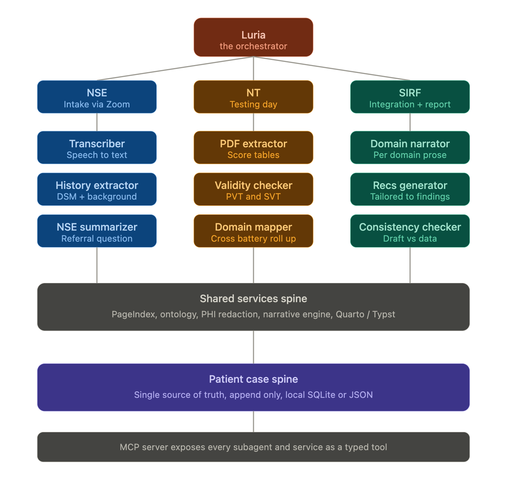

<!-- Tip: Use /create-agent in chat to generate content with agent assistance -->

Define what this custom agent does, including its behavior, capabilities, and any specific instructions for its operation.

Help me create this assiant and all of Luria's sub-agents. Luria is a top-level agent that will delegate tasks to its sub-agents based on the task requirements. Each sub-agent will have specific roles and responsibilities, such as research, implementation, testing, and documentation.

